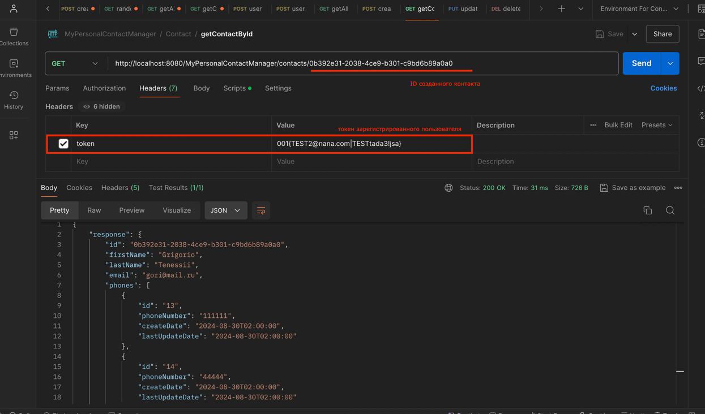

## Наименования

- переменные в классах: если 2 и более слов - *стандартный __camelCase__*

> например: userRole

- названия полей БД (несмотря на то, что сам MySQL регистро-независимый): слова начинаются с большой буквы, разделяем
  знаком подчёркивания

> например: User_Role

- все команды изменения структур БД, наименования колонок должны быть отражены в файле [
  createDatabase](./createDatabase.sql)]

>

## Flow процесса

1. Создаём новую ветку (`branch`) под новую задачу.
2. После завершения задачи и проверки работоспособности
3. Commit с коммпнтариями изменений
4. Push ветки в свой fork'нутый репозиторий
5. Запрос на PullRequest
6. После одобрения PR: обновить свой fork'нутый репозиторий и Updaet project (`merge` in `main branch`)

[//]: # (## Как работают ограничения запросов по состоянию на 27.08.2024)

[//]: # ()

[//]: # (На примере `createContact`:)

[//]: # ()

[//]: # (- добавляется `Authorization` на вкладке `Headers` &#40;остальное как и раньше&#41; и)

[//]: # (  если такой токен есть в базе `Users_Token` И пользователь этого токена `admin`, то запрос пройдёт)

[//]: # ()

[//]: # (![Заголовок должен выглядеть так]&#40;https://i.imgur.com/Ng4jIyn.png "Заголовок должен выглядеть так"&#41;)

## Как работают ограничения запросов и получение данных, созданных юзером (30.08.2024)

На примере `getContactById`:

- добавляется `token` на вкладке `Headers` (остальное как и раньше) и
  если такой токен есть в базе `Users_Token` И пользователь этого токена создавал этот контакт
- (т.е `ownerId` = `userId` токена, который вы используете)
- ИЛИ пользователь имеет роль`admin`, то запрос пройдёт

## Запрос должен выглядеть так

